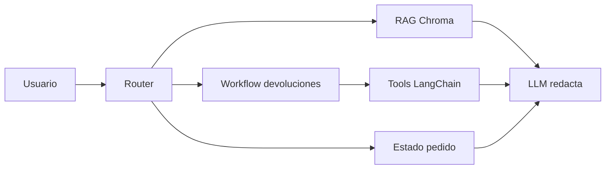
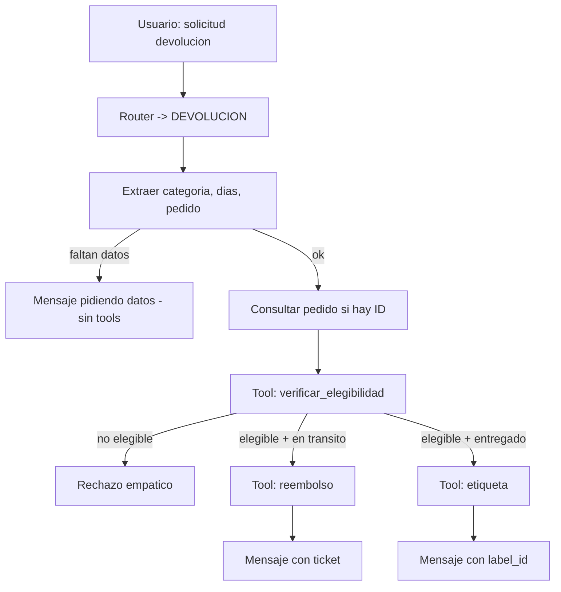

# Fase 1: Arquitectura del agente EcoMarket

## 1. Por qué un router y no un agente “libre”

En el Taller 2 el asistente ya respondía con RAG, pero solo **generaba texto**: no ejecutaba devoluciones ni consultaba pedidos de forma controlada. Para esta tercera entrega del proyecto se buscó automatizar el proceso de devolución (verificación de elegibilidad y generación de etiqueta o reembolso). Una alternativa natural era un agente ReAct que eligiera tools por sí solo; finalmente **se descartó** por una razón práctica y otra de negocio.

**Aspecto práctico:** con `llama3.2:3b` en Ollama se observaron respuestas inconsistentes (negarse a seguir instrucciones, inventar estados de pedido). Un router por reglas no es la solución más elegante, pero **acota** qué puede ocurrir en cada turno.

**Aspecto ético y operativo:** una etiqueta de devolución o un ticket de reembolso no deberían depender de la “creatividad” del modelo. Por eso **se separó** la **decisión** (código + tools) de la **redacción** (LLM opcional).

Opciones que se evaluaron:

| Enfoque | Ventaja | Motivo para descartarlo o limitarlo |
|---------|---------|--------------------------------------|
| RAG como única tool del agente | Un solo flujo cognitivo | Mezcla consultas de catálogo con acciones; dificulta la auditoría |
| Agente ReAct puro | Flexible en lenguaje | El modelo pequeño se equivoca de tool; poco trazable en demo |
| **Router + rutas (adoptado)** | Trazable, continuidad con Taller 2 | Frágil ante frases muy atípicas; mitigado con stems y fuzzy match |

El router clasifica en tres rutas antes de invocar al LLM:

| Ruta | Ejemplos de intención | Motor detrás |
|------|----------------------|--------------|
| `CONOCIMIENTO` | pagos, precios, políticas, catálogo | RAG (Chroma + `general_rag_prompt.md`) |
| `DEVOLUCION` | devolver, reembolso, producto dañado | Workflow con tools LangChain |
| `PEDIDO` | estado, tracking, número de pedido | `orders.json`; plantilla cuando hay ID |



Un router por palabras clave no escala a todos los dialectos ni a todos los errores de escritura. Se incorporó tolerancia (por ejemplo *devocluion*, *devovler*) porque en pruebas con usuarios reales el lenguaje no llega “limpio”; aun así, un clasificador entrenado o un LLM dedicado solo al routing sería más robusto en producción, con el costo de latencia y presupuesto asociado.

---

## 2. Herramientas (mínimo dos, sin contar RAG)

Se definieron cuatro funciones simuladas con `@tool` en LangChain. Dos cubren el caso de estudio base (`verificar_elegibilidad_producto`, `generar_etiqueta_devolucion`); las otras dos respondieron a situaciones que el flujo obligó a modelar.

### 2.1 `verificar_elegibilidad_producto`

Recibe `categoria` (`perecederos`, `higiene`, `ropa`, `accesorios`) y `dias_desde_compra`. Devuelve JSON con `elegible`, `motivo` e `instrucciones`. La política reside en código (`classify_return`), no en el LLM: si cambia el plazo de ropa, hay que desplegar código, no solo ajustar un prompt.

Ejemplo elegible (ropa, 10 días):

```json
{
  "categoria": "ropa",
  "dias_desde_compra": 10,
  "elegible": true,
  "motivo": "La devolucion cumple la politica vigente.",
  "instrucciones": [
    "Empaca el producto en su estado original.",
    "Genera la etiqueta de devolucion desde tu cuenta.",
    "Entrega el paquete en un punto de acopio autorizado."
  ]
}
```

Ejemplo no elegible (higiene):

```json
{
  "categoria": "higiene",
  "dias_desde_compra": 5,
  "elegible": false,
  "motivo": "Por seguridad y control sanitario, no se aceptan devoluciones de productos perecederos o de higiene personal.",
  "instrucciones": []
}
```

Fijar categorías en cuatro buckets simplifica un catálogo real (un “kit de aseo” podría discutirse). En producción la categoría debería obtenerse del ítem del pedido, no del texto libre del cliente.

### 2.2 `generar_etiqueta_devolucion`

Solo se invoca desde `returns_workflow.py` si `elegible == true` **y** el pedido está en estado que permite devolución física (entregado). Si el pedido va en tránsito, la etiqueta carece de sentido logístico; en ese caso interviene otra tool.

```json
{
  "label_id": "RET-A1B2C3D4",
  "url_descarga": "https://returns.ecomarket.co/label/RET-A1B2C3D4",
  "categoria": "ropa",
  "id_pedido": "54321",
  "estado": "generada"
}
```

### 2.3 `consultar_pedido_para_reclamo` y `generar_solicitud_reembolso`

Se incorporaron porque el proceso de devolución, en sentido amplio, incluye pedidos **en camino**: un cliente en tránsito no debería recibir etiqueta de envío inverso, sino un **reembolso** o cancelación. Sin `consultar_pedido_para_reclamo` el sistema no conocería el estado del envío; sin `generar_solicitud_reembolso` se forzaría una etiqueta incoherente.

Estas tools son mocks (JSON en memoria / registro simulado). En un OMS real harían falta idempotencia, permisos y conciliación con pagos; en esta entrega solo se demuestra el **orden** correcto de pasos.

Implementación: `src/agent_tools.py`.

---

## 3. LangChain frente a LlamaIndex

| Aspecto | LangChain (adoptado) | LlamaIndex |
|---------|----------------------|------------|
| Continuidad con Taller 2 | Mismo Chroma, embeddings, chunking | Reindexar o duplicar pipeline |
| Tools / workflows | `@tool` + orquestación explícita en Python | Fuerte en índices; otro modelo mental |
| Riesgo en plazos del curso | Bajo: se extiende lo ya funcional | Medio: migración en tiempo acotado |

No se eligió LangChain por ser “superior en abstracto”, sino porque **el costo de cambiar de marco** no aportaba valor proporcional al alcance de esta entrega. LlamaIndex habría tenido más sentido si el foco hubiera sido solo RAG avanzado; aquí el núcleo es **acción acotada** conviviendo con RAG.

LangChain añade capas y versiones; parte del código usa APIs de `langchain_community` que cambian entre releases. Las dependencias están en `requirements.txt` sin versiones fijadas: en un entorno profesional convendría pinchar versiones.

---

## 4. Flujo de devolución (decisiones explícitas)



El orden en `returns_workflow.py` es fijo: el LLM **no** decide si invocar `generar_etiqueta_devolucion`. Eso reduce el efecto de “autonomía” en la demo, pero evita el escenario más grave: etiqueta para higiene o para pedido inexistente.

En conjunto, la arquitectura es un **híbrido pragmático** (reglas + RAG + tools), no un agente plenamente autónomo al estilo de papers recientes. En atención al cliente suele pesar más **predecibilidad y auditoría** que dejar que el modelo “explore” tools sin guion.

---

## 5. Archivos de diseño

| Archivo | Rol |
|---------|-----|
| `src/intent_router.py` | Clasificación y extracción de slots (tolerancia a errores de escritura) |
| `src/agent_tools.py` | Herramientas simuladas |
| `src/returns_workflow.py` | Secuencia, reglas de envío, `audit_log` |
| `src/unified_assistant.py` | Orquestación de las tres rutas |
| `app.py` + `views/` | Interfaz: chat de usuario final y vista con diagnóstico |
