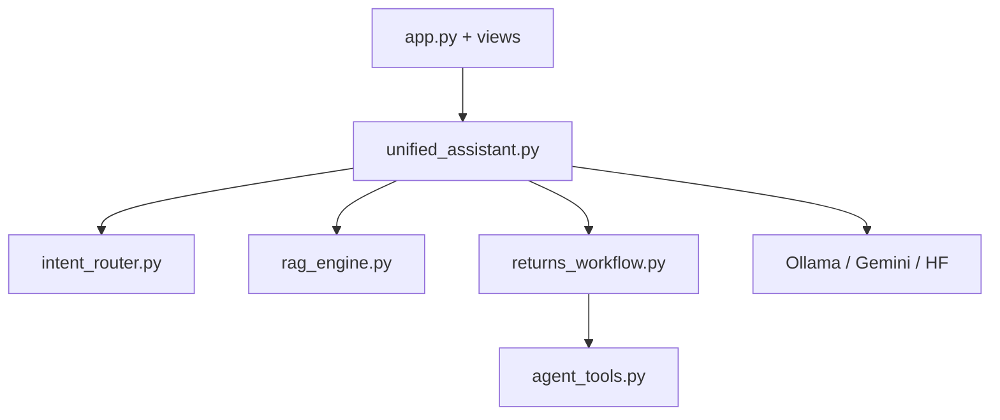

# Fase 2: Implementación y conexión de componentes

## 2.1 Qué se extendió del Taller 2 y qué no

Se partió del RAG ya construido (`rag_engine.py`, Chroma, `multilingual-e5-base`, carpeta `knowledge/`). **No se descartó ese trabajo**: el flujo de devoluciones comparte el mismo índice vectorial. La novedad es la capa que decide *cuándo* usar RAG y *cuándo* ejecutar tools.



| Módulo | Responsabilidad |
|--------|-----------------|
| `unified_assistant.py` | Punto único: router → ruta |
| `intent_router.py` | Reglas + fuzzy; prioridad de devolución sobre “mi pedido” |
| `returns_workflow.py` | Pipeline verificar → etiqueta o reembolso |
| `agent_tools.py` | Contratos JSON de acciones simuladas |
| `order_service.py` | Plantillas de estado de pedido (sin depender del LLM) |

La interfaz quedó en dos vistas (`views/cliente.py` y `views/sustentacion.py`): una simula al usuario final y otra expone **tema detectado** y **audit log**. Para la sustentación se utiliza la segunda; el objetivo es mostrar *qué* ejecutó el sistema sin exigir que quien evalúa recorra el código.

Al acoplar todo en `run_unified_assistant`, cualquier cambio en una ruta obliga a validar las demás. No hay tests unitarios automatizados en el repositorio (solo pruebas manuales con Streamlit). En un entorno profesional convendría aislar router, workflow y RAG; en esta entrega se priorizó la demostración end-to-end.

---

## 2.2 Manejo de éxito, fallo y resultados intermedios

En esta fase también se exigía que el agente **comunique** con claridad, no solo que ejecute pasos. En las pruebas aparecieron tres tipos de resultado:

1. **Éxito operativo** — las tools corrieron y el mensaje al usuario es comprensible (con o sin LLM).
2. **Fallo controlado** — la política impide la acción; no se genera etiqueta; el usuario recibe una explicación.
3. **Fallo técnico** — Ollama caído, cuota de Gemini, pedido inexistente: mensaje distinto según la vista (usuario final vs diagnóstico).

Casos tratados de forma explícita:

| Situación | Comportamiento del sistema | Motivo del diseño |
|-----------|---------------------------|-------------------|
| RAG sin evidencia suficiente | Abstención; no se inventa respuesta | Continuidad con Taller 2 |
| Devolución sin categoría/días/pedido | Se piden datos; **no** se llaman tools | Evita “verificar” con suposiciones |
| No elegible (ej. higiene) | Solo `verificar`; sin etiqueta | Fallo de negocio, no de software |
| Elegible + pedido en tránsito | Reembolso, sin etiqueta | Coherencia logística |
| Elegible + entregado | Verificar + etiqueta | Caso nominal del caso de estudio |
| Pedido con ID en JSON | Respuesta desde plantilla | El LLM local alucinaba fechas y URLs |
| LLM no disponible en devolución | `format_returns_fallback` con JSON de tools | El cliente aún ve label_id o motivo |
| Meta-refusal del modelo | Sustitución por plantilla | Comportamiento observado en modelos pequeños |

Apoyarse en plantillas cuando falla el LLM es un **respaldo explícito**, no una solución de producción. Haría falta monitorear la tasa de fallback y revisar prompts o modelo. En la vista “cliente” se ocultan detalles técnicos del error: mejora la experiencia, pero un operador debería ver el fallo real en logs centralizados.

---

## 2.3 Pruebas realizadas y límites

Se validó manualmente con prompts representativos:

| Prompt | Ruta esperada | Qué se comprobó |
|--------|---------------|-----------------|
| ¿Qué métodos de pago aceptan? | CONOCIMIENTO | RAG; no se disparan tools de devolución |
| Devolver camiseta, hace 10 días | DEVOLUCIÓN | verificar + etiqueta (con pedido entregado) |
| Devolver shampoo, 5 días | DEVOLUCIÓN | verificar; sin etiqueta |
| Estado del pedido 12345 | PEDIDO | Datos de `orders.json` |
| Quiero devolver ropa (sin días) | DEVOLUCIÓN | Pide datos; no ejecuta tools |
| Typos (*devocluion*, *devovler*) | DEVOLUCIÓN | Router tolerante |

```text
streamlit run app.py
```

Se recomienda **Ollama local** (`llama3.2:3b`). En pruebas con Gemini en free tier apareció error 429; eso no invalida el diseño, pero confirma que, para una demo en aula, conviene no depender solo de la nube.

**Fuera del alcance probado:** prompt injection dirigido a tools, carga concurrente y conversaciones muy largas (solo se conserva el último `order_id` en la sesión de Streamlit). Quedan registradas como deuda técnica.

---

## 2.4 Sobre la “autonomía” del agente

En sentido estricto, el agente **no es autónomo**: en devoluciones sigue un guion y en el router predominan reglas. Esa rigidez se asume como decisión consciente: en devoluciones, la autonomía sin controles eleva el riesgo. La ruta CONOCIMIENTO (RAG + redacción) sí se comporta de forma más conversacional, con libertad acotada por los fragmentos recuperados.

Con más tiempo de desarrollo, una línea razonable sería un **router híbrido** (reglas + clasificador ligero) y reservar ReAct para catálogo, no para etiquetas. Esa idea se desarrolla en la Fase 3.
